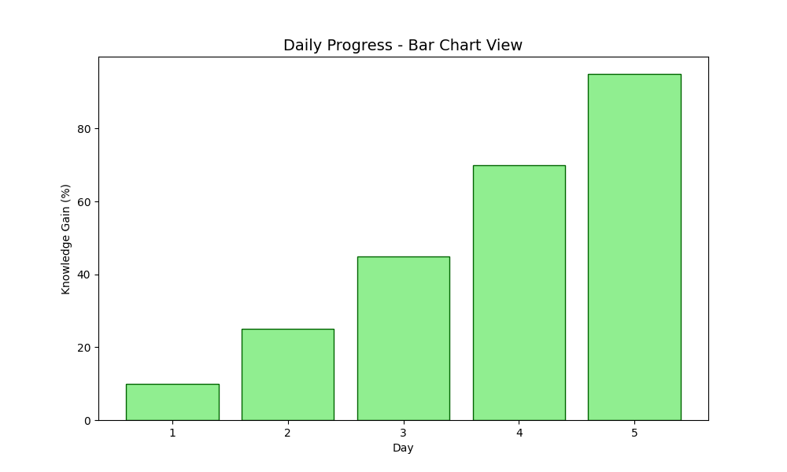
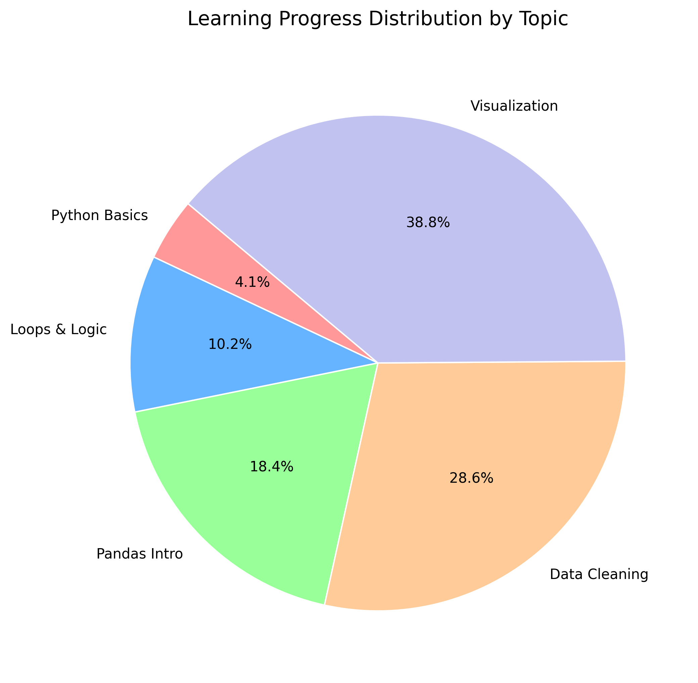
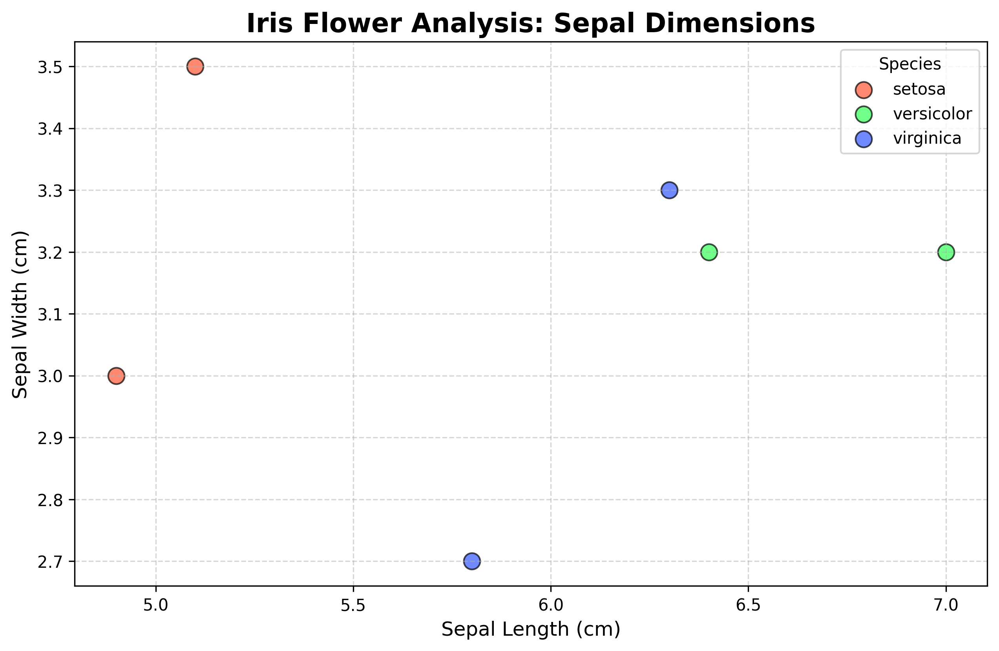

# My Python & Data Science Journey 🚀

This is where I keep all my Python scripts and data science experiments. I started from the basics and I'm now moving into data analysis and AI concepts.

## 📂 What's Inside?

### 🛠️ 01. Python Basics
Basic logic, loops, and some fun scripts I built while learning:
* Simple Calculator
* Number Guessing Game
* Exam Score Predictor

### 📈 02. Data Science (Pandas & Matplotlib)
This section is about handling data. I use **Pandas** to manage CSV files and **Matplotlib** to see the trends.
* **Study Analyzer**: Cleaning and filtering data.
* **Progress Visualization**: Plotting my daily growth.

---

## 📊 Quick Look: My Learning Progress
I tracked my study hours and knowledge gain in a CSV file and turned it into this graph:

---

## 💻 My Setup

### 📈 Bar Chart View
I added a bar chart to get a different perspective on my daily growth. This helps to compare each day's progress more clearly.

* **Language**: Python 3.14+
* **Tools**: VS Code, PowerShell
* **Libraries**: Pandas, Matplotlib, NumPy

### 🍕 Topic-wise Progress (Pie Chart)
This chart illustrates the distribution of my learning across different Python and Data Science topics.

---

## 🌸 Project: Iris Flower Classification (Visualization)
In this section, I explore the world-renowned Iris dataset. I've used Python and Matplotlib to visualize the relationship between Sepal dimensions across different flower species.

---

*Created by **Pramod Wickramanayake***
